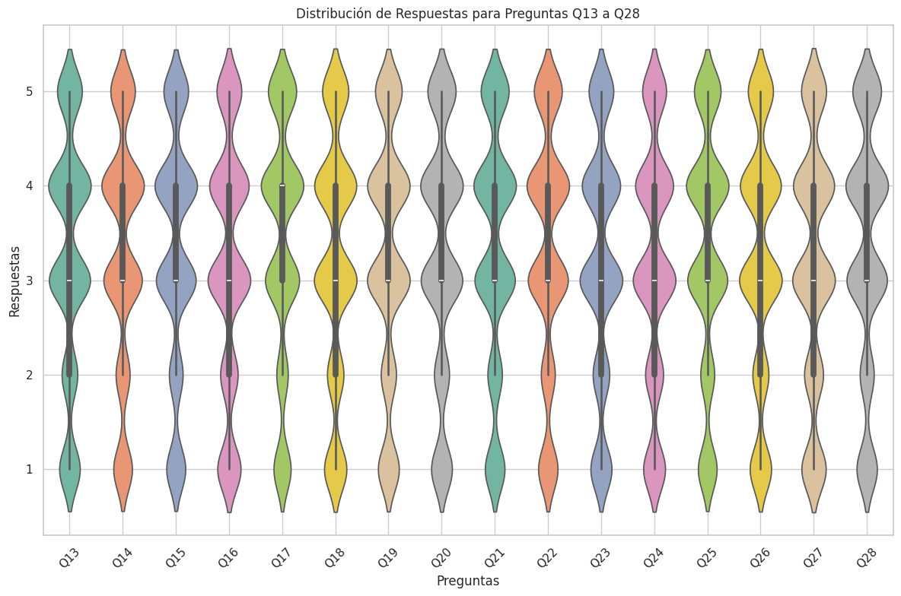
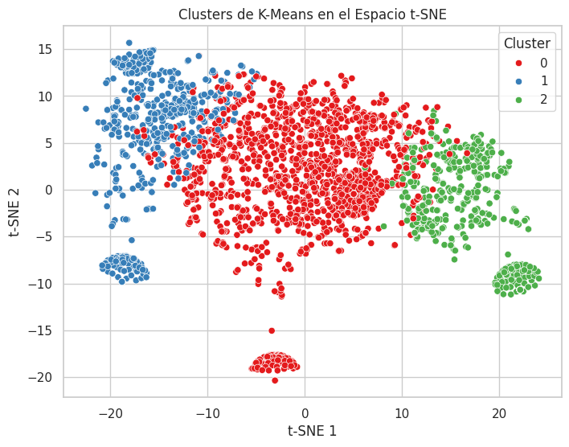
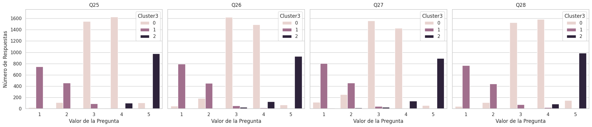

# Abstract

La evaluación del desempeño docente por parte de los estudiantes es una
práctica común que ofrece una perspectiva sobre cómo perciben la
enseñanza y la gestión de las materias por parte de los docentes. Este
trabajo tiene como objetivo interpretar las valoraciones de los
estudiantes sobre diferentes aspectos de la enseñanza, utilizando un
análisis exploratorio de datos y un modelo de clúster. Los resultados
indican que la mayoría de los estudiantes califican su experiencia con
los docentes de manera moderada, con calificaciones neutras (3, 4).
También se observa una proporción de estudiantes insatisfechos (1, 2) y
otros satisfechos (5). Estas conclusiones sugieren áreas para la mejora
en aspectos como la claridad del discurso y el uso eficiente del tiempo,
mientras que se debe mantener y reforzar el conocimiento del instructor,
su preparación, puntualidad y trato justo, ya que estos aspectos son
valorados positivamente por los estudiantes.

# Introducción

Las encuestas o cuestionarios de evaluación son uno de los métodos más
utilizados para medir el desempeño de la planta docente de un instituto
de educación. Esto permite a los docentes conocer cómo sus estudiantes
perciben sus métodos de enseñanza y al mismo tiempo a la institución
conocer la pedagogía de cada docente. El instituto a partir de los
resultados podría considerar acciones correctivas, llamadas de atención,
compensaciones, capacitaciones para mejorar la enseñanza de la planta
docente, de igual manera los docentes pueden conocer como son
identificados y caracterizados permitiendo trabajar en ellos mismos para
mejorar o cambiar su pedagogía. Las encuestas, particularmente, pueden
ser imparciales o sesgadas, debido a que cada estudiante es libre de
elegir cómo calificar a sus docentes. Los resultados de la encuesta
utilizada en este trabajo serán analizados de manera detallada, no solo
con base en los resultados, sino también mediante un análisis
exploratorio de datos y la aplicación de un modelo de clusterización.
Nuestro objetivo es encontrar la percepción que tienen los estudiantes
de sus docentes mediante un análisis del dominio del problema.

# Trabajos relacionados

Como lo afirma (Winer, DiGenova, Costopoulos, & Cardoso, 2016) las
encuestas de evaluación son imparciales y confiables, aunque esto puede
ser debatible y generar polémica en cuanto a la validez de las
respuestas estudiantiles. Sin embargo (Groen & Herry, 2017) mencionan
que las encuestas brindan resultados sesgados y pocos precisos, esto se
puede apoyar al comportamiento descrito por (Maurer, 2006) que indica
que los estudiantes con buenas notas califican al docente de manera
positiva y manera negativa si poseen malas notas. De igual manera
(Zumbach & Funke, 2014) indica que el estado de ánimo es un factor
importante en las respuestas de las encuestas aplicadas. El análisis
exploratorio de datos (ADA) como lo indica (Dhar, 2013) permite a los
líderes educativos analizar más a fondo sus datos, en lugar de centrarse
simplemente en interpretar resultados, el uso de ADA y otras técnicas de
ciencia de datos combinan en una amplia gama de conjuntos de habilidades
(análisis básico, estadísticas, modelos de aprendizaje e inteligencia
artificial) permitiendo predecir el impacto futuro de una decisión con
base en sus datos. Lo más importante para el uso eficaz de ADA es el
conocimiento subyacente del profesional que da significado a los
resultados e impulsa la necesidad de cambio necesario. (Bill & Melinda
Gates Foundation, 2015; Dhar, 2013; Tichnor-Wagner, Wachen, Cannata y
Cohen-Vogel, 2017)

# Descripción del dataset

El conjunto de datos utilizado en este trabajo esta compuesto por 33
columnas, las cuales son descritas en la siguiente tabla:

| Nombre     | Descripción                                                                                                                                         | Tipo     |
|----------|----------------------------------------------------|----------|
| instr      | Identificador del docente                                                                                                                           | Numérico |
| class      | Código del curso                                                                                                                                    | Númerico |
| repeat     | Número de veces que el estudiante tomo el curso                                                                                                     | Númerico |
| attendance | Código del nivel de asistencia                                                                                                                      | Númerico |
| difficulty | Nivel de dificultad del curso percibida por el estudiante                                                                                           | Númerico |
| Q1         | El contenido del curso semestral, el método de enseñanza y el sistema de evaluación se proporcionaron desde el inicio.                              | Númerico |
| Q2         | Los objetivos del curso se establecieron claramente desde el inicio del período.                                                                    | Númerico |
| Q3         | El curso valió la cantidad de créditos que se le asignaron.                                                                                         | Númerico |
| Q4         | El curso se impartió de acuerdo con el programa anunciado el primer día de clase.                                                                   | Númerico |
| Q5         | Los debates en clase, las tareas, las aplicaciones y los estudios fueron satisfactorios.                                                            | Númerico |
| Q6         | El libro de texto y otros recursos del curso fueron suficientes y actualizados.                                                                     | Númerico |
| Q7         | El curso permitió trabajo de campo, aplicaciones, laboratorio, debate y otros estudios.                                                             | Númerico |
| Q8         | Los cuestionarios, las tareas, los proyectos y los exámenes contribuyeron a facilitar el aprendizaje.                                               | Númerico |
| Q9         | Disfruté mucho de la clase y estaba ansioso por participar activamente durante las conferencias.                                                    | Númerico |
| Q10        | Mis expectativas iniciales sobre el curso se cumplieron al final del período o año.                                                                 | Númerico |
| Q11        | El curso fue relevante y beneficioso para mi desarrollo profesional.                                                                                | Númerico |
| Q12        | El curso me ayudó a ver la vida y el mundo con una nueva perspectiva.                                                                               | Númerico |
| Q13        | El conocimiento del instructor era relevante y actualizado.                                                                                         | Númerico |
| Q14        | El instructor llegó preparado para las clases.                                                                                                      | Númerico |
| Q15        | El instructor enseñó de acuerdo con el plan de lecciones anunciado.                                                                                 | Númerico |
| Q16        | El instructor se comprometió con el curso y fue comprensible.                                                                                       | Númerico |
| Q17        | El instructor llegó a tiempo a las clases.                                                                                                          | Númerico |
| Q18        | El instructor tiene una presentación/discurso fluido y fácil de seguir.                                                                             | Númerico |
| Q19        | El instructor hizo un uso eficaz de las horas de clase.                                                                                             | Númerico |
| Q20        | El instructor explicó el curso y estaba ansioso por ayudar a los estudiantes.                                                                       | Númerico |
| Q21        | El instructor demostró un enfoque positivo hacia los estudiantes.                                                                                   | Númerico |
| Q22        | El instructor fue abierto y respetuoso con las opiniones de los estudiantes sobre el curso.                                                         | Númerico |
| Q23        | El instructor alentó la participación en el curso.                                                                                                  | Númerico |
| Q24        | El instructor asignó tareas/proyectos relevantes y ayudó/guió a los estudiantes.                                                                    | Númerico |
| Q25        | El instructor respondió preguntas sobre el curso dentro y fuera del curso.                                                                          | Númerico |
| Q26        | El sistema de evaluación del instructor (preguntas de mitad de curso y finales, proyectos, tareas, etc.) midió eficazmente los objetivos del curso. | Númerico |
| Q27        | El instructor proporcionó soluciones a los exámenes y las discutió con los estudiantes.                                                             | Númerico |
| Q28        | El instructor trató a todos los estudiantes de manera correcta y objetiva.                                                                          | Númerico |

A partir de las columnas anteriores, se han seleccionado las siguientes
columnas que van en dirección al objetivo de este trabajo: **instr,
Q13-Q28**. La primera columna servirá como etiqueta de nuestro modelo de
clusterización. Las preguntas desde la 13 hasta la 28 se centran en
aspectos clave de la enseñanza del docente como conocimiento,
preparación, comprensión, fluidez de enseñanza, participación, forma de
evaluar a los estudiantes. No se realizó ningún tipo de preprocesamiento
o transformación a los datos, ya que estos se encuentran limpios y sin
valores ausentes, además las preguntas toman valores desde el 1 al 5.
Donde se asignó 1 = Nunca, 2 = Casi nunca, 3 = A veces, 4 = Casi
siempre, 5 = Siempre.

# Metodología

Las variables de nuestro conjunto de datos se encuentran en una escala
Likert, los datos de estudio son ordinales. Este tipo de datos no solo
implica que los valores tienen un orden específico, sino que también es
crucial identificar que las diferencias entre los puntos de la escala no
son necesariamente equidistantes. Esto sugiere que, aunque las
respuestas estén estandarizadas en términos de escala, su naturaleza
ordinal requiere un manejo cuidadoso en el modelado, asegurando que las
técnicas utilizadas respeten la estructura inherente de los datos.
Además, al trabajar con modelos de aprendizaje no supervisado, es
fundamental considerar la normalización o estandarización adecuada para
mejorar la eficacia de los algoritmos aplicados, ya que el rango
limitado y la escala uniforme pueden influir en los resultados de
clustering o reducción de dimensionalidad, entre otros enfoques.

La gráfica del método del codo muestra un descenso pronunciado en la
suma de cuadrados dentro del cluster a medida que aumenta el número de
clusters. El punto donde la disminución de deja de ser tan pronunciada
indica el número óptimo de clusters, en el caso del conjunto de datos
seleccionado, la gráfica recomienda que los valores para el número de
clusters puede ser 3 o 4. Con los números de cluster definidos se
identifica y evalua cuál de los clusters es más significativo y útil
para aplicarlo sobre los datos.

En el análisis exploratorio de datos, se examinan las distribuciones de
las variables relevantes y se realiza una comparación conjunta de las
mismas, con el objetivo de extraer conclusiones preliminares alineadas
con el propósito de evaluación intrínseco de cada pregunta. Para
visualizar las distribuciones de las respuestas, se utilizó un gráfico
de violín que permite comparar directamente la distribución de
respuestas entre las diferentes preguntas. Esta herramienta gráfica
facilita la identificación de patrones, tendencias y posibles áreas de
interés o mejora al observar cómo varían las percepciones de los
estudiantes en relación con cada aspecto evaluado.

```{r, echo=FALSE, fig.pos='H', out.width="100%"}

```

Este gráfico elimina la necesidad de un análisis descriptivo exhaustivo,
ya que las medias se sitúan en un rango estrecho de aproximadamente 3.1
a 3.4, con una varianza cercana a 1.2. Estos patrones se reflejan
claramente en el gráfico de violín, donde se observa una mayor densidad
de respuestas en los valores 3 y 4 para cada pregunta.

La simetría de las distribuciones indica que las respuestas están
distribuidas de manera uniforme alrededor de la mediana, lo que sugiere
que los estudiantes tienen una opinión equilibrada sobre los aspectos
del curso y los instructores. Esto propone una satisfacción general con
los docentes. Es importante destacar que en preguntas como la 13, 14, 17
y 28 se observa una ligera concentración de respuestas entre los valores
4 y 5, lo que podría indicar que los estudiantes valoran positivamente
el conocimiento del instructor, su preparación, puntualidad y trato
justo. Estos aspectos reflejan un alto nivel de compromiso por parte de
los docentes.

Por otro lado, preguntas como la 16, 18 y 19 muestran una mayor
dispersión en las respuestas, lo que indica un cierto grado de
variabilidad en la percepción de los estudiantes sobre la claridad en la
exposición de los temas del curso y la capacidad del instructor para ser
comprendido. Esta variabilidad sugiere que estas preguntas están más
sujetas a interpretaciones personales o a diferencias en las
expectativas de los estudiantes respecto a los profesores y los cursos.
La pregunta 19, que evalúa el uso efectivo del tiempo en clase, aunque
subjetiva, también puede señalar un área donde los estudiantes perciben
un posible margen de mejora.

# Resultados y Discusión

Se determinó el número recomendado de clústeres en los que se podría
dividir el conjunto de datos utilizando el Silhouette Score y el
Davies-Bouldin Score, obteniendo resultados que sugerían entre 8 y 9
clústeres. Sin embargo, identificar características significativas y con
alto grado de interpretación en un número tan elevado de clústeres se
complicaría, y no proporcionaría una recomendación clara para el
análisis del problema. Se aplicaron algoritmos de reducción de
dimensionalidad como PCA y t-SNE. Este último mostró una mayor
separación entre los clústeres, especialmente al ajustar hiperparámetros
como el `perplexity`, lo que permitió observar divisiones claras en tres
o cuatro clústeres, dependiendo del valor del hiperparámetro.

Se aplicaron varios modelos de clustering a los datos utilizando los
componentes obtenidos en los pasos anteriores. Los modelos utilizados
fueron K-Means, DBSCAN, BIRCH, Propagación de Afinidad y Clustering
Jerárquico con el método de Ward, apoyado por un dendrograma. La
reducción de dimensionalidad con PCA y t-SNE mostró que al usar dos
componentes con alta representatividad (según la gráfica de varianza
acumulada), los grupos aparecían muy juntos y correlacionados, lo que
dificultaba distinguir los clústeres en la representación gráfica en dos
dimensiones. En la siguiente gráfica se muestran los clusters obtenidos
utilizando el algoritmo de K-Means.

```{r, echo=FALSE, fig.pos='H', out.width="60%", fig.align='center'}

```

Por esta razón, K-Means se destacó como el algoritmo más adecuado para
identificar clústeres, aunque BIRCH y el método de Ward también
produjeron resultados similares. K-Means fue particularmente eficiente,
ya que no se observaron patrones irregulares en la representación en dos
dimensiones, y su enfoque basado en centroides se ajustó bien a las
características de los datos.

Finalmente, se realizó un análisis comparativo sobre la columna
clasificadora que era la del instructor o docente para identificar si
existen algunos factores representativos sobre los clusters, pero, sin
embargo, no se obtuvo análisis relevantes sobre los gráficos y
resultados de las tablas comparativas. Entonces se generó un análisis
distinto en donde de forma gráfica se visualiza cada pregunta, cada
gráfica contiene el conteo de las respuestas por cada opción elegida del
uno al cinco y segmentado por el tipo de cluster. Obtuvimos un mejor
panorama visual para establecer resultados que permitan generar
interpretaciones con un respaldo ciertamente significativo. En la
siguiente gráfica se muestra el número de respuestas obtenidas,
organizadas por clúster y desglosadas por cada uno de los valores
asignados a las preguntas finales analizadas (Q25 a Q28).

```{r, echo=FALSE, fig.pos='H', out.width="100%", fig.align='center'}

```

Tal y como se refleja en la gráfica, existen tres grupos distintos de
percepciones estudiantiles sobre la calidad de la enseñanza. El clúster
0 agrupa a estudiantes que califican la experiencia de manera moderada,
con respuestas mayormente en los valores 3 y 4, lo que sugiere una
satisfacción general pero tal vez con reconocimiento de áreas para
mejora. El clúster 1 representa a los estudiantes más insatisfechos,
quienes seleccionaron principalmente los valores 1 y 2, lo que indica
percepciones negativas sobre múltiples aspectos del curso, materia
dictada o hacia los profesores. Por último, el clúster 2 incluye a los
estudiantes más satisfechos, con un índice alto de respuestas en el
valor 5, reflejando una alta satisfacción con la enseñanza o tal vez una
falta de interés hacia la evaluación del docente debido a un apego hacia
el curso o materia impartida por el profesor.

En el análisis general, se observa que los estudiantes en el clúster 2
muestran una satisfacción consistente en todos los aspectos evaluados,
destacándose en preguntas relacionadas con la preparación del
instructor, la claridad en la enseñanza y la evaluación del curso. Por
otro lado, el clúster 1 revela preocupaciones específicas en áreas como
la claridad del discurso y la eficacia del tiempo de clase, donde se
perciben más deficiencias. El clúster 0 sugiere una percepción positiva
pero no sobresaliente, con un enfoque en la mejora continua. Estos
patrones permiten identificar no solo las áreas de éxito, sino también
aquellas que requieren atención para elevar la satisfacción general de
los estudiantes.

# Conclusión

El análisis de las respuestas agrupadas por clústeres ha revelado
patrones claros en la percepción de los estudiantes sobre la calidad de
la enseñanza. Los clústeres identificados muestran una variabilidad
significativa en la satisfacción estudiantil: el clúster 0 representa a
estudiantes moderadamente satisfechos, el clúster 1 agrupa a aquellos
con una opinión negativa y el clúster 2 agrupa a los estudiantes muy
satisfechos. Esto sugiere que, aunque una la mayor parte de estudiantes
tienen una percepción positiva sobre la enseñanza, existe una fracción
significativa que identifica áreas de mejora importantes,
particularmente en la claridad del discurso, el uso efectivo del tiempo
en clase, y la estructura de las asignaciones y evaluaciones.

El uso de técnicas de clústering permitió segmentar a los estudiantes en
grupos homogéneos según sus respuestas. Esto proporcionó una visión más
precisa de cómo diferentes aspectos de la enseñanza son percibidos. La
interpretación de los clústeres, en conjunto con el análisis visual de
las distribuciones de respuestas, permitió identificar patrones
relevantes que de otro modo podrían haber quedado ocultos en un análisis
descriptivo de los datos.

En cuanto al trabajo futuro, sería valioso realizar un análisis más
profundo, integrando otras variables demográficas o contextuales que
puedan influir en la percepción de los estudiantes. También se podría
explorar el uso de modelos predictivos, como la regresión logística,
para identificar qué factores específicos están más fuertemente
asociados con la pertenencia a cada clúster, lo que podría guiar mejoras
específicas en la enseñanza. Además, un seguimiento a través del tiempo
podría ayudar a evaluar cómo las intervenciones basadas en este análisis
afectan la satisfacción estudiantil en el tiempo.

# Contribuciones

En el presente trabajo, ambos integrantes participaron activamente en
todas las etapas del proyecto. Colaboramos en la generación del código
para el análisis, realizamos juntos la visualización de los resultados
en una computadora y redactamos varios párrafos de cada sección del
informe. Debido a nuestra participación conjunta en todas las fases del
proceso, la contribución de cada uno sobre el trabajo fue equitativa.

# Referencias

Winer, L., DiGenova, L., Costopoulos, A., & Cardoso, K. (2016).
Addressing common concerns about online student ratings of instruction:
A research-informed approach. Canadian Journal of Higher Education/Revue
canadienne d’enseignement supérieur, 46(4), 115–131.

Groen, J. F., & Herry, Y. (2017). The online evaluation of courses:
Impact on participation rates and evaluation scores. Canadian Journal of
Higher Education/Revue canadienne d’enseignement supérieur, 47(2),
106–120.

Maurer, T. W. (2006). Cognitive dissonance or revenge? Student grades
and course evaluations. Teaching of Psychology, 33, 176–179.

Zumbach, J., & Funke. J. (2014). Influences of Mood on Academic Course
Evaluations. Practical Assessment, Research & Evaluation, 19(4), 1–12.
Retrieved from <http://pareonline.net/getvn/getvn.asp?v=19&n=4>.

Dhar, V. (2013). Data science and prediction. Communications of the ACM,
56(12), 64–73. <doi:10.1145/2500499>

Bill & Melinda Gates Foundation. (2015). Making data work for teachers
and students. Seattle, WA: Bill & Melinda Gates Foundation.

Tichnor-Wagner, A., Wachen, J., Cannata, M., & Cohen-Vogel, L. (2017).
Continuous improvement in the public school context: Understanding how
educators respond to plando-study-act cycles. Journal of Education
Change, 18(4), 465–494. <doi:10.1007/s10833-017-9301-4>.
